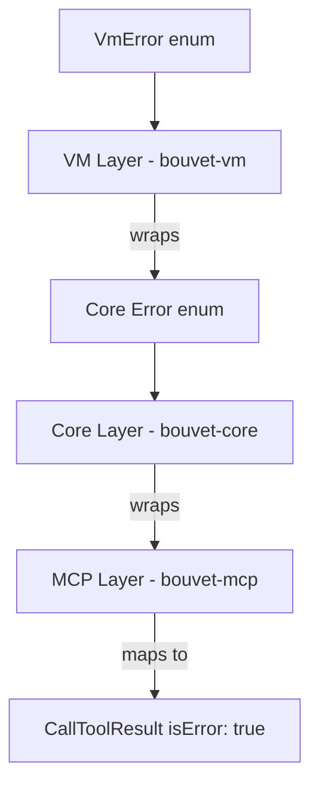

# Error Handling Strategy

> **Layer**: Cross-cutting (Layers 2-5)

This document describes error types, propagation patterns, and retry semantics across Bouvet's layers.

---

## Error Hierarchy

Errors flow upward through the stack, with each layer wrapping lower-level errors:



```
┌──────────────────────────────────────────┐
│ MCP Layer (bouvet-mcp)                   │
│ CallToolResult { isError: true }         │
└──────────────────┬───────────────────────┘
                   │ mapped from
┌──────────────────▼───────────────────────┐
│ Core Layer (bouvet-core)                 │
│ CoreError enum                           │
└──────────────────┬───────────────────────┘
                   │ wraps
┌──────────────────▼───────────────────────┐
│ VM Layer (bouvet-vm)                     │
│ VmError enum                             │
└──────────────────────────────────────────┘
```

---

## VmError Variants

Defined in [error.rs](file:///Users/vrn21/Developer/rust/petty/crates/bouvet-vm/src/error.rs):

| Variant | Description | When Triggered |
|---------|-------------|----------------|
| `Create(String)` | VM creation failed | Firecracker spawn failure |
| `Start(String)` | VM start failed | InstanceActionInfo error |
| `Stop(String)` | VM stop failed | Kill/shutdown failure |
| `InvalidState` | Wrong state transition | e.g., start on running VM |
| `Config(String)` | Bad configuration | Invalid vcpus, memory, paths |
| `Firepilot(String)` | SDK error | firepilot API failures |
| `Io(io::Error)` | IO operation failed | File/socket access errors |
| `Timeout(Duration)` | Operation timed out | Boot/connect deadline exceeded |

---

## CoreError Variants

Defined in [error.rs](file:///Users/vrn21/Developer/rust/petty/crates/bouvet-core/src/error.rs):

| Variant | Cause | Example |
|---------|-------|---------|
| `Vm(VmError)` | Wrapped VM layer error | `CoreError::Vm(VmError::Create(...))` |
| `Connection(String)` | vsock connect failed | Socket not found, handshake rejected |
| `AgentTimeout(Duration)` | Connection timeout | Agent not ready after 10s |
| `Rpc { code, message }` | Agent returned error | Method not found, invalid params |
| `NotFound(SandboxId)` | Unknown sandbox | Invalid UUID in request |
| `InvalidState` | Wrong sandbox state | Execute on destroyed sandbox |
| `Json(serde_json::Error)` | Serialization failed | Malformed JSON request/response |
| `Io(io::Error)` | IO operation failed | Socket read/write errors |

### Error Wrapping Pattern

```rust
// VmError automatically converts to CoreError via From trait
#[derive(Debug, Error)]
pub enum CoreError {
    #[error("VM error: {0}")]
    Vm(#[from] bouvet_vm::VmError),
    // ...
}
```

---

## Agent Error Codes

The agent uses JSON-RPC 2.0 standard error codes:

| Code | Name | Description |
|------|------|-------------|
| -32700 | Parse error | Invalid JSON received |
| -32600 | Invalid request | Not a valid JSON-RPC request |
| -32601 | Method not found | Unknown method name |
| -32602 | Invalid params | Wrong parameter type/value |
| -32603 | Internal error | Server-side error |
| -1 | Custom | Response timeout or missing result |

---

## MCP Layer Error Mapping

The MCP server ([server.rs](file:///Users/vrn21/Developer/rust/petty/crates/bouvet-mcp/src/server.rs)) converts all `CoreError` variants to `CallToolResult::error()`:

```rust
fn error_result(message: impl Into<String>) -> CallToolResult {
    CallToolResult::error(vec![Content::text(message.into())])
}
```

Tools return results via pattern matching:

```rust
match result {
    Ok(data) => Self::json_result(&data),
    Err(e) => Self::error_result(format!("{}", e)),
}
```

> [!IMPORTANT]
> All error details are exposed to the MCP client via the `Display` implementation. Avoid including sensitive paths or internal state in error messages.

---

## Retry Semantics

| Operation | Retries? | Interval | Total Timeout |
|-----------|----------|----------|---------------|
| Agent connect | Yes | 100ms | 10s |
| RPC call | No | — | 30s |
| Pool health check | No | — | — |

### Agent Connection Retry

The [AgentClient::connect](file:///Users/vrn21/Developer/rust/petty/crates/bouvet-core/src/client.rs#L50-L83) method implements a retry loop:

```rust
const CONNECT_TIMEOUT: Duration = Duration::from_secs(10);
const RETRY_INTERVAL: Duration = Duration::from_millis(100);

loop {
    match Self::try_connect(vsock_path).await {
        Ok(client) => return Ok(client),
        Err(e) => {
            if start.elapsed() >= CONNECT_TIMEOUT {
                return Err(CoreError::AgentTimeout(CONNECT_TIMEOUT));
            }
            tokio::time::sleep(RETRY_INTERVAL).await;
        }
    }
}
```

### RPC Timeout

Individual RPC calls do **not** retry:

```rust
const RPC_TIMEOUT: Duration = Duration::from_secs(30);

match timeout(RPC_TIMEOUT, self.reader.read_line(&mut response_str)).await {
    Ok(Ok(_)) => { /* parse response */ }
    Ok(Err(e)) => return Err(e.into()),
    Err(_) => return Err(CoreError::Rpc { code: -1, message: "response timeout".into() }),
}
```

---

## Pool Health Check

During sandbox acquisition, the pool pings to verify health:

```rust
// In pool.rs
if !sandbox.is_healthy().await {
    // Discard unhealthy sandbox, try next
    sandbox.destroy().await;
    continue;
}
```

Failed health checks result in immediate discard — no retries.

---

## Error Handling Best Practices

1. **Use `?` for propagation**: Let errors bubble up naturally
2. **Add context with `.map_err()`**: Include operation-specific details
3. **Log before returning**: Use `tracing::warn!` for unexpected errors
4. **Avoid panics**: All fallible operations return `Result`

```rust
// Good: Context-rich error
socket.connect().await.map_err(|e| CoreError::Connection(
    format!("socket connect failed: {e}")
))?;

// Bad: Raw error loses context
socket.connect().await?;
```
