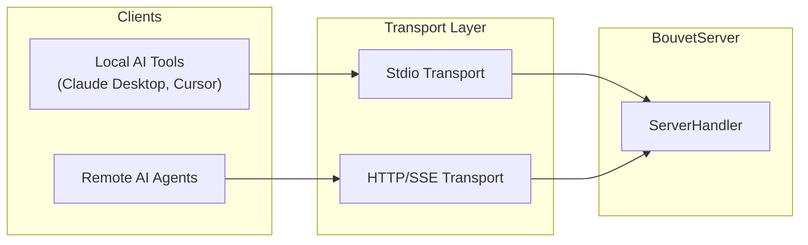
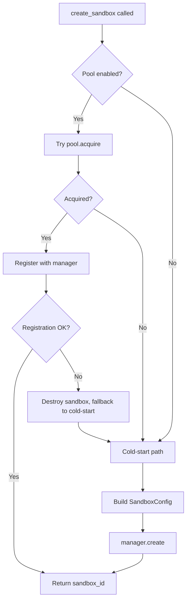
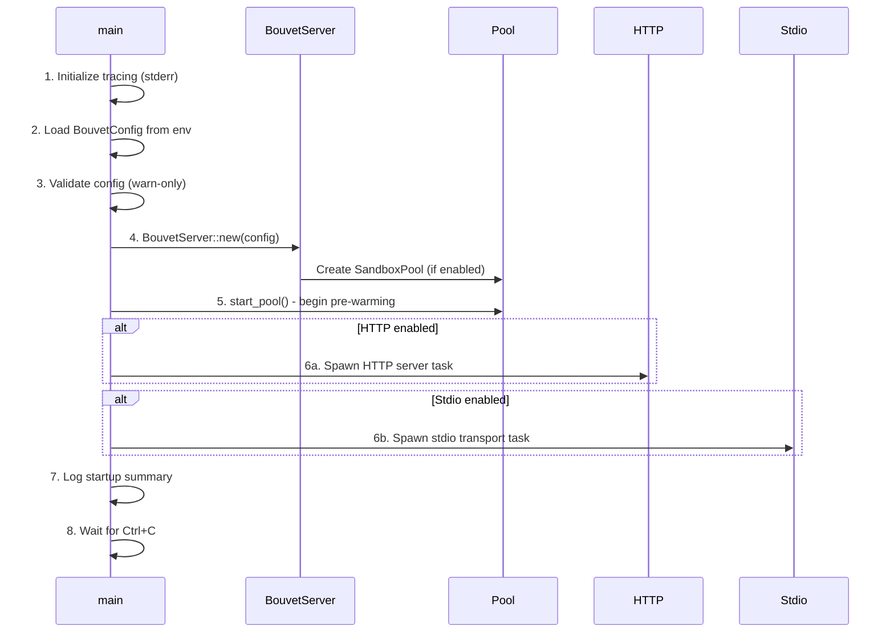
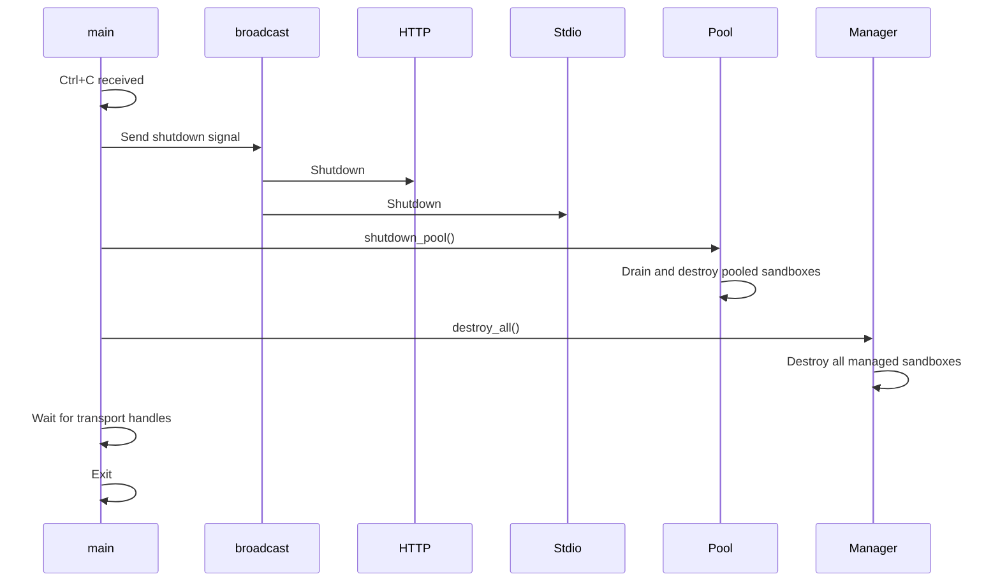

# MCP Server Layer

> **Layer**: 5 (bouvet-mcp)  
> **Related Code**: [`server.rs`](file:///Users/vrn21/Developer/rust/petty/crates/bouvet-mcp/src/server.rs), [`http.rs`](file:///Users/vrn21/Developer/rust/petty/crates/bouvet-mcp/src/http.rs), [`config.rs`](file:///Users/vrn21/Developer/rust/petty/crates/bouvet-mcp/src/config.rs), [`main.rs`](file:///Users/vrn21/Developer/rust/petty/crates/bouvet-mcp/src/main.rs), [`types.rs`](file:///Users/vrn21/Developer/rust/petty/crates/bouvet-mcp/src/types.rs)

This document describes the MCP (Model Context Protocol) server implementation in `bouvet-mcp`, the top layer of the Bouvet architecture that exposes sandbox operations as tools for AI agents.

---

## 11.1 Architecture

```
┌──────────────────────────────────────────────────────┐
│                    BouvetServer                       │
├──────────────────────────────────────────────────────┤
│  manager: Arc<SandboxManager>                         │
│  pool: Option<Arc<TokioMutex<SandboxPool>>>          │
│  config: BouvetConfig                                 │
└───────────────────┬──────────────────────────────────┘
                    │
        ┌───────────┴───────────┐
        ▼                       ▼
┌───────────────┐       ┌───────────────┐
│    stdio      │       │     HTTP      │
│  transport    │       │  transport    │
│ (rmcp crate)  │       │ (axum + SSE)  │
└───────────────┘       └───────────────┘
```

### Core Components

| Component | Type | Purpose |
|-----------|------|---------|
| `manager` | `Arc<SandboxManager>` | Central sandbox registry from `bouvet-core` |
| `pool` | `Option<Arc<TokioMutex<SandboxPool>>>` | Warm pool for reduced latency (optional) |
| `config` | `BouvetConfig` | Server configuration from environment |

### Transport Selection



---

## 11.2 BouvetConfig

Configuration is loaded from environment variables with sensible defaults.

### Environment Variables

| Variable | Default | Description |
|----------|---------|-------------|
| `BOUVET_KERNEL` | `/var/lib/bouvet/vmlinux` | Path to kernel image |
| `BOUVET_ROOTFS` | `/var/lib/bouvet/debian-devbox.ext4` | Path to rootfs image |
| `BOUVET_FIRECRACKER` | `/usr/local/bin/firecracker` | Path to Firecracker binary |
| `BOUVET_CHROOT` | `/tmp/bouvet` | Working directory for VMs |
| `BOUVET_TRANSPORT` | `both` | Transport mode: `stdio`, `http`, or `both` |
| `BOUVET_POOL_ENABLED` | `true` | Enable warm pool |
| `BOUVET_POOL_MIN_SIZE` | `3` | Minimum warm sandboxes in pool |
| `BOUVET_POOL_MAX_BOOTS` | `2` | Max concurrent boot operations |
| `BOUVET_HTTP_HOST` | `0.0.0.0` | HTTP server bind address |
| `BOUVET_HTTP_PORT` | `8080` | HTTP server port |

### Transport Modes

| Mode | Stdio | HTTP | Use Case |
|------|-------|------|----------|
| `stdio` | ✅ | ❌ | Local AI tools (Claude Desktop) |
| `http` | ❌ | ✅ | Remote AI agents, web clients |
| `both` | ✅ | ✅ | Maximum compatibility (default) |

### Input Limits

| Constant | Value | Purpose |
|----------|-------|---------|
| `MAX_INPUT_SIZE_BYTES` | 10 MB | Maximum code/content size |
| `MAX_COMMAND_LENGTH` | 1 MB | Maximum shell command length |

---

## 11.3 Tool Implementations

The server exposes 8 MCP tools for sandbox operations:

### Sandbox Lifecycle Tools

| Tool | Handler Method | Description |
|------|----------------|-------------|
| `create_sandbox` | [`handle_create_sandbox`](file:///Users/vrn21/Developer/rust/petty/crates/bouvet-mcp/src/server.rs#L197-290) | Create a new sandbox (pool-aware) |
| `destroy_sandbox` | [`handle_destroy_sandbox`](file:///Users/vrn21/Developer/rust/petty/crates/bouvet-mcp/src/server.rs#L292-332) | Destroy a sandbox and release resources |
| `list_sandboxes` | [`handle_list_sandboxes`](file:///Users/vrn21/Developer/rust/petty/crates/bouvet-mcp/src/server.rs#L334-358) | List all active sandboxes |

### Code Execution Tools

| Tool | Handler Method | Description |
|------|----------------|-------------|
| `execute_code` | [`handle_execute_code`](file:///Users/vrn21/Developer/rust/petty/crates/bouvet-mcp/src/server.rs#L360-429) | Execute code in Python, Node.js, Bash |
| `run_command` | [`handle_run_command`](file:///Users/vrn21/Developer/rust/petty/crates/bouvet-mcp/src/server.rs#L431-493) | Run shell command |

### File Operation Tools

| Tool | Handler Method | Description |
|------|----------------|-------------|
| `read_file` | [`handle_read_file`](file:///Users/vrn21/Developer/rust/petty/crates/bouvet-mcp/src/server.rs#L495-539) | Read file from sandbox |
| `write_file` | [`handle_write_file`](file:///Users/vrn21/Developer/rust/petty/crates/bouvet-mcp/src/server.rs#L541-597) | Write file to sandbox |
| `list_directory` | [`handle_list_directory`](file:///Users/vrn21/Developer/rust/petty/crates/bouvet-mcp/src/server.rs#L599-652) | List directory contents |

### Pool-Aware Creation Flow



### Request/Response Types

All types are defined in [`types.rs`](file:///Users/vrn21/Developer/rust/petty/crates/bouvet-mcp/src/types.rs) with schemars for automatic JSON Schema generation:

```rust
// Example: CreateSandboxParams
struct CreateSandboxParams {
    memory_mib: Option<u32>,   // Default: 256
    vcpu_count: Option<u8>,    // Default: 2
}

// Example: ExecResponse
struct ExecResponse {
    exit_code: i32,
    stdout: String,
    stderr: String,
}
```

---

## 11.4 HTTP Transport

The HTTP transport ([`http.rs`](file:///Users/vrn21/Developer/rust/petty/crates/bouvet-mcp/src/http.rs)) uses axum with rmcp's `StreamableHttpService`.

### Endpoints

| Method | Path | Description |
|--------|------|-------------|
| `POST` | `/mcp` | JSON-RPC requests |
| `GET` | `/mcp` | SSE stream for server messages |
| `GET` | `/health` | Health check |
| `GET` | `/` | Server info (HTML) |

### Middleware Stack

```rust
Router::new()
    .route("/health", get(health_handler))
    .route("/", get(root_handler))
    .fallback_service(mcp_service)  // rmcp StreamableHttpService
    .layer(CorsLayer::new()
        .allow_origin(Any)
        .allow_methods(Any)
        .allow_headers(Any))
    .layer(TraceLayer::new_for_http())
```

### Health Check Response

```json
{
  "status": "healthy",
  "service": "bouvet-mcp"
}
```

### Example Request

```bash
curl -X POST http://localhost:8080/mcp \
  -H "Content-Type: application/json" \
  -d '{"jsonrpc":"2.0","id":1,"method":"tools/list"}'
```

---

## 11.5 Startup Sequence

The startup sequence is implemented in [`main.rs`](file:///Users/vrn21/Developer/rust/petty/crates/bouvet-mcp/src/main.rs):



### Shutdown Sequence



### Key Startup Code

```rust
#[tokio::main]
async fn main() -> anyhow::Result<()> {
    // 1. Initialize tracing
    tracing_subscriber::registry()
        .with(EnvFilter::from_default_env())
        .with(tracing_subscriber::fmt::layer().with_writer(std::io::stderr))
        .init();

    // 2. Load configuration
    let config = BouvetConfig::from_env();
    config.validate_warn();

    // 3. Create server
    let server = BouvetServer::new(config.clone());

    // 4. Start warm pool
    server.start_pool().await;

    // 5. Create shutdown channel
    let (shutdown_tx, _) = broadcast::channel::<()>(1);

    // 6. Spawn transports based on config
    if config.transport_mode.http_enabled() {
        // Spawn HTTP task
    }
    if config.transport_mode.stdio_enabled() {
        // Spawn stdio task
    }

    // 7. Wait for Ctrl+C
    signal::ctrl_c().await?;

    // 8. Graceful shutdown
    shutdown_tx.send(())?;
    cleanup_server.shutdown_pool().await;
    cleanup_manager.destroy_all().await?;
}
```

---

## 11.6 ServerHandler Implementation

The [`BouvetServer`](file:///Users/vrn21/Developer/rust/petty/crates/bouvet-mcp/src/server.rs#L25-34) implements rmcp's `ServerHandler` trait:

### Server Info

```rust
fn get_info(&self) -> ServerInfo {
    ServerInfo {
        protocol_version: ProtocolVersion::V_2024_11_05,
        capabilities: ServerCapabilities::builder()
            .enable_tools()
            .build(),
        server_info: Implementation::from_build_env(),
        instructions: Some("Bouvet MCP Server - Create and manage...".into()),
    }
}
```

### Tool Routing

```rust
async fn call_tool(&self, request: CallToolRequestParam, _context: RequestContext<RoleServer>) 
    -> Result<CallToolResult, ErrorData> 
{
    match request.name.as_ref() {
        "create_sandbox"   => self.handle_create_sandbox(request.arguments).await,
        "destroy_sandbox"  => self.handle_destroy_sandbox(request.arguments).await,
        "list_sandboxes"   => self.handle_list_sandboxes().await,
        "execute_code"     => self.handle_execute_code(request.arguments).await,
        "run_command"      => self.handle_run_command(request.arguments).await,
        "read_file"        => self.handle_read_file(request.arguments).await,
        "write_file"       => self.handle_write_file(request.arguments).await,
        "list_directory"   => self.handle_list_directory(request.arguments).await,
        _ => Self::error_result(format!("Unknown tool: {}", request.name)),
    }
}
```

---

## 11.7 Error Handling

### Input Validation

Tools validate input sizes before processing:

```rust
fn validate_size(content: &str, max_bytes: usize, field_name: &str) -> Result<(), String> {
    if content.len() > max_bytes {
        Err(format!("{} exceeds maximum size ({} bytes > {} bytes)",
            field_name, content.len(), max_bytes))
    } else {
        Ok(())
    }
}
```

### Sandbox ID Parsing

Uses generic error messages to prevent ID enumeration:

```rust
fn parse_sandbox_id(id: &str) -> Result<SandboxId, String> {
    uuid::Uuid::parse_str(id)
        .map(SandboxId::from)
        .map_err(|_| "Sandbox not found or invalid ID".to_string())
}
```

### Result Helpers

```rust
fn json_result<T: Serialize>(data: &T) -> CallToolResult {
    CallToolResult::success(vec![Content::text(serde_json::to_string_pretty(data)?)])
}

fn error_result(message: impl Into<String>) -> CallToolResult {
    CallToolResult::error(vec![Content::text(message.into())])
}
```

---

## Related Documentation

- [Warm Pool Architecture](WARM_POOL.md) - Pool configuration and acquisition flow
- [Sandbox Manager](SANDBOX_MANAGER.md) - Central sandbox registry
- [Sandbox Lifecycle](SANDBOX_LIFECYCLE.md) - Sandbox state machine
- [Error Handling](ERROR_HANDLING.md) - Error propagation across layers
