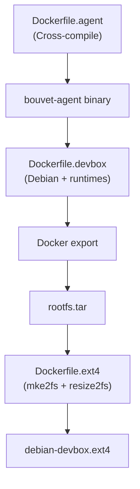

# Rootfs Image Architecture

> **Layer**: 1.5 (Between Firecracker and VM — the disk image)  
> **Related Code**: [`images/`](file:///Users/vrn21/Developer/rust/petty/images) directory, Dockerfile rootfs build

This document covers the ext4 rootfs image that boots inside Firecracker microVMs.

---

## 1. Base Image

### Distribution
- **Base**: Debian Bookworm (`debian:bookworm-slim`)
- **filesystem**: ext4 with journal
- **Label**: `bouvet-rootfs`

### Size Constraints
| Parameter | Default | Description |
|-----------|---------|-------------|
| Initial allocation | 2500M | Maximum size before optimization |
| Final size | ~700-900MB | After `resize2fs -M` shrinking |
| Runtime growth | Dynamic | Image grows as files are written |

### Optimization Techniques
1. `apt-get clean` — Remove package cache
2. Remove `/usr/share/doc`, `/usr/share/man`, `/usr/share/info`
3. Truncate all logs in `/var/log`
4. Run `resize2fs -M` to shrink to minimum blocks
5. Docker multi-stage builds to minimize layers

---

## 2. Pre-installed Runtimes

| Runtime | Version | Binary Path | Purpose |
|---------|---------|-------------|---------|
| Python | 3.11+ | `/usr/bin/python3` | Code execution |
| Node.js | 20.x | `/usr/bin/node` | JavaScript execution |
| Bash | 5.x | `/bin/bash` | Shell commands |
| Rust | stable | `/usr/local/cargo/bin/rustc` | Rust compilation |

### Additional Development Tools
- **Build**: `build-essential`, `pkg-config`, `cmake`, `clang`
- **Debug**: `strace`, `gdb`
- **Network**: `curl`, `wget`, `iproute2`, `dnsutils`
- **Utilities**: `git`, `vim`, `jq`, `htop`, `tree`

### Runtime Installation Details

```dockerfile
# Python (from Debian repos)
python3, python3-pip, python3-venv, python3-dev

# Node.js (from NodeSource)
curl -fsSL https://deb.nodesource.com/setup_20.x | bash -

# Rust (via rustup)
curl --proto '=https' --tlsv1.2 -sSf https://sh.rustup.rs | sh -s -- -y
```

---

## 3. Agent Installation

### Binary Location
- **Path**: `/usr/local/bin/bouvet-agent`
- **Permissions**: Executable (`chmod +x`)
- **Compilation**: Static musl binary (no runtime deps)

### Systemd Service
- **File**: [`/etc/systemd/system/bouvet-agent.service`](file:///Users/vrn21/Developer/rust/petty/images/bouvet-agent.service)

```ini
[Unit]
Description=Bouvet Guest Agent
After=network.target
After=systemd-modules-load.service

[Service]
Type=simple
User=root
ExecStart=/usr/local/bin/bouvet-agent
Restart=on-failure
RestartSec=2
StartLimitIntervalSec=60
StartLimitBurst=5
StandardOutput=journal+console
StandardError=journal+console
Environment="RUST_LOG=debug"
Environment="RUST_BACKTRACE=1"

[Install]
WantedBy=multi-user.target
```

### Configuration
| Setting | Value | Reason |
|---------|-------|--------|
| Type | `simple` | No forking, agent runs in foreground |
| User | `root` | Required for vsock access |
| Restart | `on-failure` | Auto-restart on crash |
| RestartSec | `2s` | Wait before restart |
| Rate limit | 5 in 60s | Prevent restart loops |

---

## 4. Boot Sequence

```
┌─────────────────────────────────────────────────────────────┐
│ 1. Firecracker loads vmlinux kernel                         │
│    └─ Kernel image: /var/lib/bouvet/vmlinux                │
└─────────────────────────────────────────────────────────────┘
                              ▼
┌─────────────────────────────────────────────────────────────┐
│ 2. Kernel mounts rootfs.ext4 as /                           │
│    └─ Mount: /dev/vda → / (ext4, defaults)                 │
└─────────────────────────────────────────────────────────────┘
                              ▼
┌─────────────────────────────────────────────────────────────┐
│ 3. systemd starts as PID 1                                  │
│    └─ CMD ["/sbin/init"]                                   │
└─────────────────────────────────────────────────────────────┘
                              ▼
┌─────────────────────────────────────────────────────────────┐
│ 4. Kernel modules loaded                                    │
│    └─ vsock, vmw_vsock_virtio_transport                    │
└─────────────────────────────────────────────────────────────┘
                              ▼
┌─────────────────────────────────────────────────────────────┐
│ 5. bouvet-agent.service starts                              │
│    └─ After: network.target, systemd-modules-load.service  │
└─────────────────────────────────────────────────────────────┘
                              ▼
┌─────────────────────────────────────────────────────────────┐
│ 6. Agent binds vsock port 52                                │
│    └─ VsockListener::bind(VMADDR_CID_ANY, 52)              │
└─────────────────────────────────────────────────────────────┘
                              ▼
┌─────────────────────────────────────────────────────────────┐
│ 7. Agent ready for host connections                         │
│    └─ Logs: "listening on vsock port 52"                   │
└─────────────────────────────────────────────────────────────┘
```

### Boot Time
- **Cold boot**: ~300-500ms (kernel → agent ready)
- **Agent bind**: <50ms after systemd starts service

---

## 5. Build Process

The rootfs is built through a 3-stage Docker pipeline:



### Stage 1: Agent Compilation ([Dockerfile.agent](file:///Users/vrn21/Developer/rust/petty/images/Dockerfile.agent))

Cross-compiles the bouvet-agent for Linux musl target:

```bash
# Build agent via Docker (works on macOS)
make agent ARCH=aarch64  # or x86_64
```

| Target | Rust Triple | Docker Platform |
|--------|-------------|-----------------|
| ARM64 | `aarch64-unknown-linux-musl` | `linux/arm64` |
| x86_64 | `x86_64-unknown-linux-musl` | `linux/amd64` |

### Stage 2: Devbox Image ([Dockerfile.devbox](file:///Users/vrn21/Developer/rust/petty/images/Dockerfile.devbox))

Builds the full development environment:

1. Install Debian base packages
2. Add Python 3, Node.js 20, Rust
3. Configure vsock module loading
4. Copy bouvet-agent binary
5. Install systemd service
6. Configure network (`eth0` via DHCP)
7. Set up serial console

### Stage 3: ext4 Conversion ([Dockerfile.ext4](file:///Users/vrn21/Developer/rust/petty/images/Dockerfile.ext4))

Converts Docker image to ext4 filesystem:

```bash
# Extract Docker image to tarball
docker export container > rootfs.tar

# Create ext4 from directory (no mount needed)
mke2fs -t ext4 -d /rootfs -L "bouvet-rootfs" /rootfs.ext4 2500M

# Shrink to minimum size
e2fsck -f -y /rootfs.ext4
resize2fs -M /rootfs.ext4
```

### Full Build Command

```bash
# Build for ARM64 (default on Apple Silicon)
make rootfs

# Build for x86_64
make rootfs ARCH=x86_64

# Custom image size
make rootfs IMAGE_SIZE=4G
```

### Output
- **File**: `images/output/debian-devbox.ext4`
- **Size**: ~700-900MB (after shrinking)

---

## 6. Filesystem Layout

```
/
├── bin/                    # Essential binaries (bash, etc.)
├── dev/
│   └── vsock              # vsock device node
├── etc/
│   ├── fstab              # /dev/vda / ext4 defaults 0 1
│   ├── hostname           # "bouvet"
│   ├── modules-load.d/
│   │   └── vsock.conf     # vsock, vmw_vsock_virtio_transport
│   ├── network/
│   │   └── interfaces     # eth0 dhcp config
│   └── systemd/
│       └── system/
│           └── bouvet-agent.service
├── root/                   # Root user home
├── tmp/                    # Temp files, code execution
├── usr/
│   ├── bin/
│   │   ├── python3 → python
│   │   └── node
│   └── local/
│       ├── bin/
│       │   └── bouvet-agent
│       ├── cargo/         # Rust cargo
│       └── rustup/        # Rust toolchains
└── var/
    └── log/               # System logs (truncated)
```

---

## 7. vsock Configuration

### Module Loading
The rootfs pre-configures vsock modules to load at boot:

```bash
# /etc/modules-load.d/vsock.conf
vsock
vmw_vsock_virtio_transport
```

### Device Verification
At boot, the agent verifies `/dev/vsock` exists:

```rust
if !std::path::Path::new("/dev/vsock").exists() {
    return Err("/dev/vsock does not exist - vsock kernel module may not be loaded");
}
```

---

## 8. Network Configuration

### Interfaces
```
# /etc/network/interfaces
auto lo
iface lo inet loopback

auto eth0
iface eth0 inet dhcp
```

### Note
Network is configured but **not used** for host-guest communication. All communication happens via vsock, which is faster and more secure.

---

## 9. Security Considerations

| Aspect | Status | Notes |
|--------|--------|-------|
| Root password | `root:root` | Development convenience |
| Agent runs as | `root` | Required for vsock + file ops |
| Network isolation | Full | No inbound network access |
| vsock only | Yes | Single communication channel |

> [!WARNING]
> The default root password is for development only. In production, consider disabling password auth or using a random password per instance.
