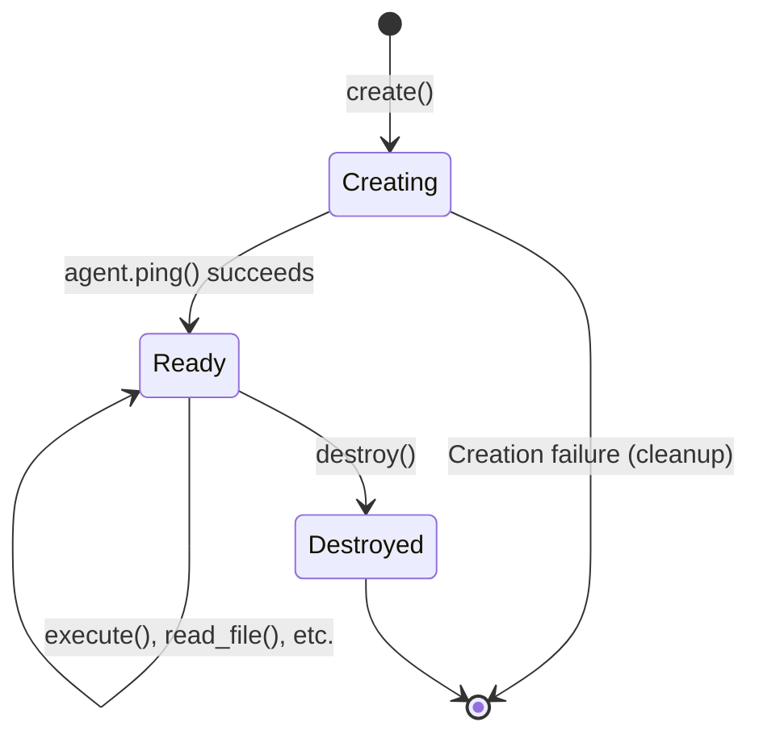

# Sandbox Lifecycle

**Layer**: 4 (bouvet-core)  
**Related Code**: [`sandbox.rs`](file:///Users/vrn21/Developer/rust/petty/crates/bouvet-core/src/sandbox.rs), [`manager.rs`](file:///Users/vrn21/Developer/rust/petty/crates/bouvet-core/src/manager.rs)

> The sandbox is the primary abstraction in bouvet-core — a running microVM with a connected guest agent, ready to execute commands and manage files in complete isolation.

---

## 1. Sandbox State Machine



| State | Description |
|-------|-------------|
| `Creating` | VM is booting, agent is starting, vsock connection in progress |
| `Ready` | Sandbox is fully operational, agent is responsive |
| `Destroyed` | Resources released, sandbox cannot be used |

### State Transitions

```rust
pub enum SandboxState {
    Creating,   // VM booting, agent connecting
    Ready,      // Ready for commands
    Destroyed,  // Resources released
}
```

All state transitions are **one-way**:
- `Creating` → `Ready` (on successful agent ping)
- `Ready` → `Destroyed` (on explicit destroy)
- Any state → Cleanup on failure

---

## 2. SandboxId

`SandboxId` is a newtype wrapper around `Uuid` (v4) that uniquely identifies each sandbox:

```rust
pub struct SandboxId(Uuid);
```

| Property | Description |
|----------|-------------|
| Type | `Uuid` (v4, random) |
| Format | `xxxxxxxx-xxxx-xxxx-xxxx-xxxxxxxxxxxx` |
| Scope | Matches underlying VM ID |
| Usage | Key in `SandboxManager` registry |

**Creation**:
```rust
let id = SandboxId::new();  // Generates random UUID
```

**Conversion**:
```rust
impl From<Uuid> for SandboxId { ... }
impl fmt::Display for SandboxId { ... }
```

---

## 3. Sandbox Components

```rust
pub struct Sandbox {
    id: SandboxId,
    vm: bouvet_vm::VirtualMachine,     // Firecracker VM wrapper
    client: Arc<Mutex<AgentClient>>,   // vsock connection to agent
    config: SandboxConfig,             // Creation configuration
    state: SandboxState,               // Current lifecycle state
    created_at: DateTime<Utc>,         // Creation timestamp
}
```

### Component Diagram

```
┌───────────────────────────────────────────────────────────┐
│                        Sandbox                             │
├───────────────────────────────────────────────────────────┤
│  id: SandboxId           created_at: DateTime<Utc>        │
│  state: SandboxState     config: SandboxConfig            │
├───────────────────────────────────────────────────────────┤
│  ┌─────────────────────┐   ┌───────────────────────────┐  │
│  │   VirtualMachine    │   │ Arc<Mutex<AgentClient>>   │  │
│  │   (bouvet-vm)       │   │ (vsock connection)        │  │
│  └─────────────────────┘   └───────────────────────────┘  │
└───────────────────────────────────────────────────────────┘
```

---

## 4. Creation Flow

`Sandbox::create()` orchestrates the full creation process:

```
┌─────────────────────────────────────────────────────────────────────────┐
│  Sandbox::create(config)                                                 │
│  ───────────────────────────────────────────────────────────────────────│
│                                                                          │
│  1. Generate SandboxId (UUID v4)                                        │
│                              │                                           │
│                              ▼                                           │
│  2. Create vsock directory:  {chroot_path}/{sandbox_id}/v.sock          │
│                              │                                           │
│                              ▼                                           │
│  3. Build VmConfig with VmBuilder:                                      │
│     - vcpus, memory, kernel, rootfs                                     │
│     - vsock_config (unique per VM)                                      │
│                              │                                           │
│                              ▼                                           │
│  4. VirtualMachine::create_with_id(sandbox_id, config)                  │
│     → Firecracker boots, VM runs                                        │
│                              │                                           │
│                              ▼                                           │
│  5. AgentClient::connect(vsock_path)                                    │
│     → Retry loop: 100ms interval, 10s timeout                           │
│     → CONNECT handshake → "OK 52\n"                                     │
│                              │                                           │
│                              ▼                                           │
│  6. client.ping()  → Verify agent responsive                            │
│                              │                                           │
│                              ▼                                           │
│  7. Return Sandbox { state: Ready, ... }                                │
│                                                                          │
└─────────────────────────────────────────────────────────────────────────┘
```

### Error Recovery

If any step fails, resources are cleaned up:
- VM creation failure → Remove vsock directory
- Agent connection failure → VM destroyed, directory removed

---

## 5. Operations (Ready State)

All operations require the sandbox to be in `Ready` state. The `ensure_ready()` helper validates this before each call:

| Operation | Method | Agent RPC |
|-----------|--------|-----------|
| Shell command | `execute(cmd)` | `exec` |
| Code execution | `execute_code(lang, code)` | `exec_code` |
| Read file | `read_file(path)` | `read_file` |
| Write file | `write_file(path, content)` | `write_file` |
| List directory | `list_dir(path)` | `list_dir` |

### Thread Safety

The `AgentClient` is wrapped in `Arc<Mutex<_>>` for thread-safe access:

```rust
pub async fn execute(&self, cmd: &str) -> Result<ExecResult, CoreError> {
    self.ensure_ready()?;
    let mut client = self.client.lock().await;  // Acquire mutex
    client.exec(cmd).await
}
```

---

## 6. Health Checking

`is_healthy()` verifies the sandbox is operational:

```rust
pub async fn is_healthy(&self) -> bool {
    // 1. Check state is Ready
    if self.state != SandboxState::Ready {
        return false;
    }
    
    // 2. Try to acquire client lock (non-blocking)
    let mut client = match self.client.try_lock() {
        Ok(c) => c,
        Err(_) => return true,  // Client busy = still working
    };
    
    // 3. Ping agent
    client.ping().await.is_ok()
}
```

| Condition | Result |
|-----------|--------|
| State ≠ Ready | `false` |
| Client mutex busy | `true` (assumed healthy) |
| Ping succeeds | `true` |
| Ping fails | `false` |

> [!NOTE]
> Health checks are used by the warm pool to validate sandboxes before serving them to clients. Unhealthy sandboxes are discarded.

---

## 7. Timeout Handling

| Operation | Timeout | Retry? |
|-----------|---------|--------|
| Agent connection | 10s total | Yes (100ms interval) |
| RPC call | 30s per call | No |
| Health check | Inherit RPC timeout | No |

### Timeout Constants

Defined in [`client.rs`](file:///Users/vrn21/Developer/rust/petty/crates/bouvet-core/src/client.rs):

```rust
const CONNECT_TIMEOUT: Duration = Duration::from_secs(10);
const RETRY_INTERVAL: Duration = Duration::from_millis(100);
const RPC_TIMEOUT: Duration = Duration::from_secs(30);
```

On timeout, the sandbox should be destroyed to release resources.

---

## 8. Destruction Flow

```rust
pub async fn destroy(mut self) -> Result<(), CoreError> {
    self.state = SandboxState::Destroyed;
    
    // 1. Stop VM via Firecracker API
    self.vm.destroy().await?;
    
    // 2. Clean up vsock directory
    let vsock_dir = self.config.chroot_path.join(self.id.to_string());
    tokio::fs::remove_dir_all(&vsock_dir).await.ok();
    
    Ok(())
}
```

### Cleanup Actions

1. Set state to `Destroyed` (prevents further operations)
2. Call `VirtualMachine::destroy()` → Kills Firecracker process
3. Remove sandbox directory: `{chroot_path}/{sandbox_id}/`

> [!IMPORTANT]
> `destroy()` takes ownership of `self`, ensuring the sandbox cannot be used after destruction.

---

## 9. SandboxConfig

Configuration for creating sandboxes:

```rust
pub struct SandboxConfig {
    pub kernel_path: PathBuf,      // vmlinux kernel image
    pub rootfs_path: PathBuf,      // rootfs.ext4 disk image
    pub chroot_path: PathBuf,      // Working directory (default: /tmp/bouvet)
    pub memory_mib: u32,           // Memory in MiB (default: 256)
    pub vcpu_count: u8,            // vCPU count (default: 2)
    pub timeout: Option<Duration>, // Operation timeout
    pub vsock_cid: u32,            // Guest CID (default: 3, assigned by manager)
}
```

### Builder Pattern

```rust
let config = SandboxConfig::builder()
    .kernel("/var/lib/bouvet/vmlinux")
    .rootfs("/var/lib/bouvet/rootfs.ext4")
    .memory_mib(512)
    .vcpu_count(4)
    .build()?;
```

### Validation Rules

| Field | Requirement |
|-------|-------------|
| `kernel_path` | Must be non-empty |
| `rootfs_path` | Must be non-empty |
| `memory_mib` | Must be > 0 |
| `vcpu_count` | Must be > 0 |
| `vsock_cid` | Must be >= 3 |

---

## 10. Integration with SandboxManager

The `SandboxManager` provides lifecycle management for multiple sandboxes:

```rust
pub struct SandboxManager {
    sandboxes: Arc<RwLock<HashMap<SandboxId, Sandbox>>>,
    config: ManagerConfig,
    cid_counter: AtomicU32,  // Starts at 3
}
```

### Manager Operations

| Method | Description |
|--------|-------------|
| `create(config)` | Create new sandbox, assign CID, register |
| `create_default()` | Create with manager's default paths |
| `register(sandbox)` | Register pool-acquired sandbox |
| `destroy(id)` | Remove and destroy sandbox |
| `destroy_all()` | Cleanup on shutdown |
| `execute(id, cmd)` | Direct command execution |
| `list()` | List all sandbox IDs |

### CID Assignment

The manager assigns unique Context IDs atomically:

```rust
config.vsock_cid = self.cid_counter.fetch_add(1, Ordering::Relaxed);
```

- Starts at 3 (CIDs 0, 1, 2 are reserved by vsock spec)
- Monotonically increasing (no reuse)
- Prevents vsock collisions between VMs

### Sandbox Limit

```rust
pub max_sandboxes: usize,  // default: 100, 0 = unlimited
```

Checked before creation or registration to prevent resource exhaustion.
